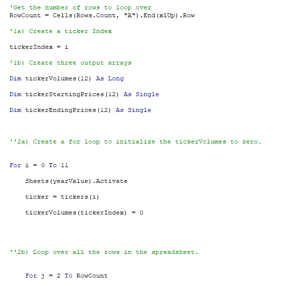
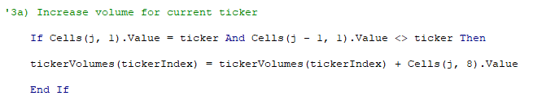
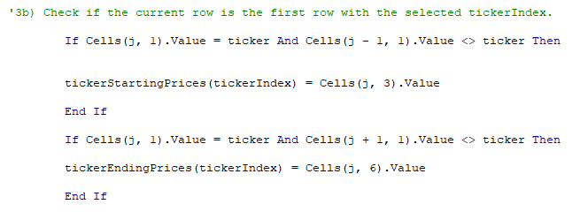
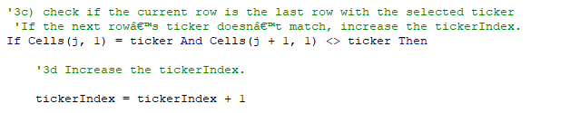
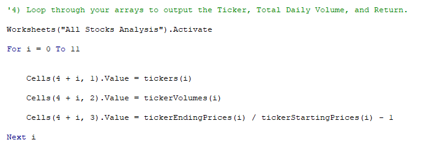
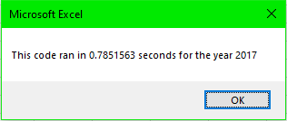
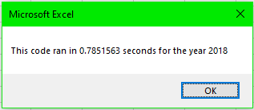

# Module_2_Challenge

## Purpose
####    The purpose of this challenge is to refactor, or 'edit', old code  to increase  scalability, i. e. to be able to analyze the data of thousands of stocks rather than a dozen stocks.

## Background
####    Steve, the client, hired me to write a script that could analyze and visualize the stock data that he had collected.  I wrote a simple script to analyze the given stocks, however later on in the development of the project, Steve asked that I make the script to accept the data of thousands of stocks rather than the few that were provided initially.  To meet the requirements of the client, I refactored the script.

## Results
####    To begin the refactoring, I created an index (tickerIndex) to hold the index of the array I was working with held in the following for loops.

####    To calculate the volume of the curreent ticket first I set the tickerVolumes to zero.  Within the for loops exists a scaling 'tickerVolumes' variable that holds the sum of the volume of the current indexed ticker as it reaches the total.

####    To calculate a scaling Return, tickerStartingPrices and tickerEndingPrices are calculated with if-then statements within the nested for loop as well.

####    Then, when the current indexed ticket is totalled, an if-then statement allows the first for loop to continue to the next index.

####    Another For loop is created to output the 'Ticker,' 'Total Daily Volume,' and 'Return' as they are processed by the first for loops.

####    This concluded the refactoring and at the end, the computing speed of the script is approximately 0.8 seconds.

## Summary
####    The advantage of refactoring code in general is that it decreases server-load for data, and increases computation speed for the end user so that even very demanding applications can run on hardware that is less load-bearing.  Although it costs the company more money to hire more employees, pay existing employees a higher salary, and/or hire more experienced workers, the benefits of what refactoring does for the product far outweigh those costs.

####    The refactoring of this specific script is very advantageous as it allows for many more stocks to be tracked and analyzed than the initial version.  While the initial version ran faster, it was very limited in capacity.